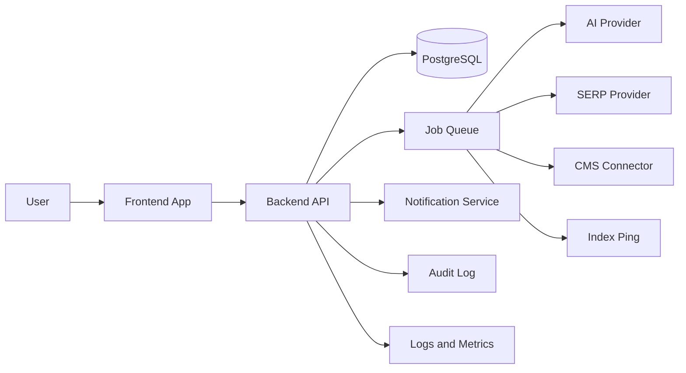

# System Architecture and End-to-End Flow

## 1. High-level Architecture

## 2. Main Components

- Frontend App: dashboard, editor, keyword tracking, cluster view
- Backend API: auth, article lifecycle, SEO scoring, integrations
- Database: content, versions, jobs, rank history, audit logs
- Queue Worker: outline generation, draft generation, SERP analysis, refresh
- External Providers: AI, search data, CMS, indexing

## 3. Core Flow

### 3.1 Create new article
1. User enters title and primary keyword
2. Frontend sends request to backend
3. Backend creates article record
4. Backend queues outline generation job
5. Worker calls AI provider and stores outline
6. User reviews outline
7. Backend queues draft generation job
8. Worker creates article version
9. Backend runs SEO scoring
10. User approves and publishes

### 3.2 Rank tracking and refresh
1. Backend ingests rank snapshot
2. System checks rank decay rule
3. If threshold hit, create alert
4. Create refresh job
5. Worker compares article with top SERP
6. Worker returns refresh draft
7. User reviews diff
8. User approves publish

### 3.3 Internal link suggestion
1. Backend scans site content graph
2. System finds related articles
3. Worker ranks suggestions
4. Frontend shows anchor suggestions
5. User applies selected links

## 4. Data Flow

- Read-heavy views use API query layer
- AI tasks go through queue
- All writes create audit events
- Published content keeps immutable versions

## 5. Deployment Shape

- Frontend app
- Backend API service
- Worker service
- PostgreSQL
- Redis for queue/cache

## 6. Guardrails

- Refresh never overwrites approved content directly
- Jobs must be retryable
- External provider failures must not block UI
- Every publish action is logged

